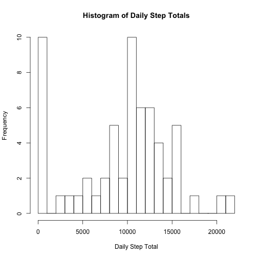
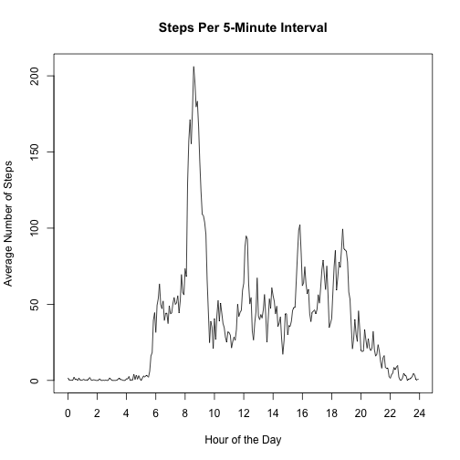
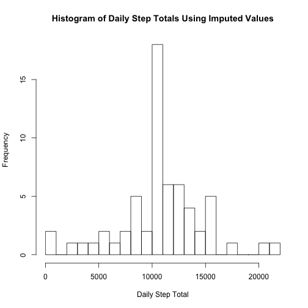

## Loading and preprocessing the data

First, ensure the working directory in R is set to the directory containing "activity.csv".
Then run the following code to load the file into a data frame:


```r
data <- read.csv('activity.csv')
```

## What is mean total number of steps taken per day?

Histogram of daily step totals:

```r
stepsPerDay <- aggregate(data$steps, list(date = data$date), sum, na.rm=TRUE)
hist(stepsPerDay$x, breaks=20,
     main="Histogram of Daily Step Totals", xlab="Daily Step Total")
```

 

Mean and median of total number of steps taken per day:

```r
mean(stepsPerDay$x)
```

```
## [1] 9354.23
```

```r
median(stepsPerDay$x)
```

```
## [1] 10395
```

## What is the average daily activity pattern?

Calculate the average number of steps taken in each 5-minute interval:


```r
stepsPerInterval <- aggregate(steps ~ interval, data=data, mean)
```

Time-series graph of the average number of steps per 5-minute interval:


```r
plot(1:nrow(stepsPerInterval), stepsPerInterval$steps, type='l', xaxt='n',
     main='Steps Per 5-Minute Interval',
     xlab='Hour of the Day',
     ylab='Average Number of Steps')
axis(1, labels=seq(0,24,2), at=seq(1,nrow(stepsPerInterval) + 1,24))
```

 

Which interval contains the maximum number of steps?


```r
stepsPerInterval[which.max(stepsPerInterval$steps), 'interval']
```

```
## [1] 835
```

## Imputing missing values

For each observation, replace NA values with the average for that 5-minute interval:


```r
imputed <- data.frame(data)
for(i in 1:nrow(imputed)){
    if(is.na(imputed[i, 'steps'])){
        inter <- imputed[i, 'interval']
        imputed[i, 'steps'] <- stepsPerInterval[stepsPerInterval$interval == inter, 'steps']
    }
}
```

Make a histogram of steps per day using imputed values:


```r
stepsPerDayImp <- aggregate(steps ~ date, data=imputed, sum)
hist(stepsPerDayImp$steps, breaks=20,
     main="Histogram of Daily Step Totals Using Imputed Values", xlab="Daily Step Total")
```

 

Calculate and report the mean and median total number of steps taken per day:


```r
mean(stepsPerDayImp$steps)
```

```
## [1] 10766.19
```

```r
median(stepsPerDayImp$steps)
```

```
## [1] 10766.19
```

Do these values differ from the estimates from the first part of the assignment? What is the impact of imputing missing data on the estimates of the total daily number of steps?

The daily totals are significantly higher because values that were previously assumed to be 0 now are assumed to have a positive value. Interestingly, the median is the same as the mean. This is due to the way values were imputed. Since there were entire days with missing data, these days all took on the shape of the "average day", and therefore all have the same total.

## Are there differences in activity patterns between weekdays and weekends?

Create a new factor variable in the dataset with two levels – “weekday” and “weekend” indicating whether a given date is a weekday or weekend day:


```r
imputed$dayOfWeek <- weekdays(as.Date(imputed$date, format='%Y-%m-%d'))
imputed$dayType = 'weekday'
imputed[imputed$dayOfWeek %in% c('Saturday', 'Sunday'), 'dayType'] <- 'weekend'
```

Make a panel plot containing a time series plot (i.e. type = "l") of the 5-minute interval (x-axis) and the average number of steps taken, averaged across all weekday days or weekend days (y-axis):


```r
library(lattice)
stepsPerIntervalImp <- aggregate(steps ~ interval + dayType, data=imputed, mean)
xyplot(steps ~ interval | dayType, data=stepsPerIntervalImp, layout = c(1,2), type='l')
```

 
